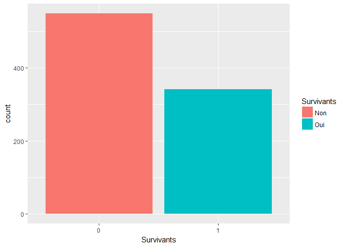
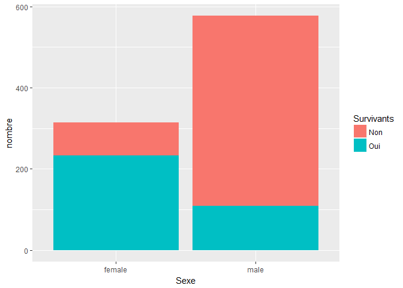
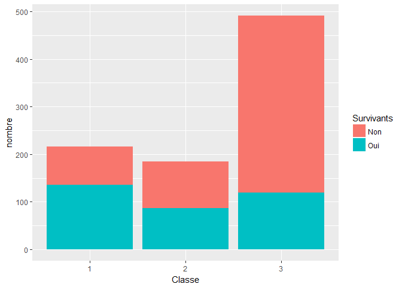

Compétition Kaggle : Titanic
================
Gaëlle Roger
25 janvier 2018

La description de la compétion est disponible à cette adresse : <https://www.kaggle.com/c/titanic> . Il s'agit de prédire à l'aide d'un jeu de données, la survie de passagers du célèbre paquebot.

Load packages
-------------

``` r
library(ggplot2)
library(dplyr)
library(statsr)
```

Récupération des données
------------------------

Récupération des données d'entrainement du modèle `train_data` et du jeu de données pour le test `test_data`.

``` r
train_data <- read.table("./data/TITANIC/train.csv",sep = ",",header = TRUE, na.strings = c("NA", ""))
test_data <- read.table("./data/TITANIC/test.csv",sep = ",",header = TRUE, na.strings = c("NA", ""))
```

Exploration des données
-----------------------

La des cription complète du dataset peut être trouvée à cette adresee : <https://www.kaggle.com/c/titanic/data>. Voici les différentes variables à notre disposition :

``` r
str(train_data)
```

    ## 'data.frame':    891 obs. of  12 variables:
    ##  $ PassengerId: int  1 2 3 4 5 6 7 8 9 10 ...
    ##  $ Survived   : int  0 1 1 1 0 0 0 0 1 1 ...
    ##  $ Pclass     : int  3 1 3 1 3 3 1 3 3 2 ...
    ##  $ Name       : Factor w/ 891 levels "Abbing, Mr. Anthony",..: 109 191 358 277 16 559 520 629 417 581 ...
    ##  $ Sex        : Factor w/ 2 levels "female","male": 2 1 1 1 2 2 2 2 1 1 ...
    ##  $ Age        : num  22 38 26 35 35 NA 54 2 27 14 ...
    ##  $ SibSp      : int  1 1 0 1 0 0 0 3 0 1 ...
    ##  $ Parch      : int  0 0 0 0 0 0 0 1 2 0 ...
    ##  $ Ticket     : Factor w/ 681 levels "110152","110413",..: 524 597 670 50 473 276 86 396 345 133 ...
    ##  $ Fare       : num  7.25 71.28 7.92 53.1 8.05 ...
    ##  $ Cabin      : Factor w/ 147 levels "A10","A14","A16",..: NA 82 NA 56 NA NA 130 NA NA NA ...
    ##  $ Embarked   : Factor w/ 3 levels "C","Q","S": 3 1 3 3 3 2 3 3 3 1 ...

Tout d'abord, les variables `Pclass` et `Survived` enregistrées en `integer` sont converties en `factor` qui est plus adequat poiur des variables de catégories :

``` r
train_data$Survived <- as.factor(train_data$Survived)
train_data$Pclass <- as.ordered(train_data$Pclass)

test_data$Pclass <- as.ordered(test_data$Pclass)
```

Création d'une variable `family_mb` qui est la somme des variables `SibSp` et `Parch` et qui représente pour chaque passager le nombre de membres de sa familles également présents à bord :

``` r
train_data <- train_data %>%
  mutate(family_mb = SibSp + Parch)

test_data <- test_data %>%
  mutate(family_mb = SibSp + Parch)
```

Vérifions la présences de `NA` dans le jeu de variables, c'est à dire de données non renseignées :

``` r
sapply(train_data, function(x) {sum(is.na(x))})
```

    ## PassengerId    Survived      Pclass        Name         Sex         Age 
    ##           0           0           0           0           0         177 
    ##       SibSp       Parch      Ticket        Fare       Cabin    Embarked 
    ##           0           0           0           0         687           2 
    ##   family_mb 
    ##           0

Il manque 177 données pour la variable âge, 687 pour le numéro de cabine et 2 pour le port d'embarquement.

Variables d'intérêt
-------------------

### Les survivants

La variable à prédire ici est évidemment `Survived`. Regardons la répartion des personnes ayant survécu ou non :

``` r
ggplot(train_data, aes(Survived)) +
  geom_bar(stat = "count" , aes(fill = Survived)) +
    xlab("Survivants") +
    scale_fill_discrete(name="Survivants",
                         breaks=c(0,1),
                         labels=c("Non", "Oui"))
```



``` r
train_data %>%
  group_by(Survived) %>%
  summarise(nombre = n()) %>%
  mutate(freq = round(nombre / sum(nombre), 2))
```

    ## # A tibble: 2 x 3
    ##   Survived nombre  freq
    ##     <fctr>  <int> <dbl>
    ## 1        0    549  0.62
    ## 2        1    342  0.38

Sur l'échantillon fourni, on note que 549 personnes sont décédées dans le naufrage du Titanic et 342 ont survécu.

### Genre

Etudions le taux de survie selon le genre :

``` r
data_genre <- train_data %>%
  group_by(Sex, Survived) %>%
  summarise (nombre = n()) %>%
  mutate(freq = round(nombre / sum(nombre), 2))

data_genre
```

    ## # A tibble: 4 x 4
    ## # Groups:   Sex [2]
    ##      Sex Survived nombre  freq
    ##   <fctr>   <fctr>  <int> <dbl>
    ## 1 female        0     81  0.26
    ## 2 female        1    233  0.74
    ## 3   male        0    468  0.81
    ## 4   male        1    109  0.19

Voici la répartion graphique du nombre de survivants selon leure genre :

``` r
ggplot(data=data_genre, aes(x=Sex, y=nombre, fill=Survived)) +
  geom_bar(stat="identity") +
  xlab("Sexe") +
  scale_fill_discrete(name="Survivants",
                         breaks=c(0,1),
                         labels=c("Non", "Oui"))
```



La règles des "femmes et enfants d'abord" a effectivement été respectée : 74% des femmes ont survécu contre seulement 19% des hommes.

### Classe

Il y avait 3 classes à bord du Titanic et cela a également beaucoup influencé le taux de survie. Les 1ères classes se trouvant près du pont et les 3èmes près des cales. Regardons la répartition des survivants selon les différentes classes :

``` r
data_classe <- train_data %>%
  group_by(Pclass, Survived) %>%
  summarise (nombre = n()) %>%
  mutate(freq = round(nombre / sum(nombre), 2))

data_classe
```

    ## # A tibble: 6 x 4
    ## # Groups:   Pclass [3]
    ##   Pclass Survived nombre  freq
    ##    <ord>   <fctr>  <int> <dbl>
    ## 1      1        0     80  0.37
    ## 2      1        1    136  0.63
    ## 3      2        0     97  0.53
    ## 4      2        1     87  0.47
    ## 5      3        0    372  0.76
    ## 6      3        1    119  0.24

``` r
ggplot(data=data_classe, aes(x=Pclass, y=nombre, fill=Survived)) +
  geom_bar(stat="identity") +
  xlab("Classe") +
  scale_fill_discrete(name="Survivants",
                         breaks=c(0,1),
                         labels=c("Non", "Oui"))
```



63% des personnes en 1ère classe ont survécu, 47% en 2ème classe et enfin 24% en 3ème.

Construction du modèle
----------------------

Afin de prédire la survie de passagers inconnus, on utilise une régression logistique avec les variables explicatives suivantes : la classe : `Pclass`, `Sex` et le nombre de membres de la famille également présent à bord : `family_mb`.

``` r
m_full <- glm(Survived ~ Sex + Pclass + family_mb,family="binomial", data = train_data)
summary(m_full)
```

    ## 
    ## Call:
    ## glm(formula = Survived ~ Sex + Pclass + family_mb, family = "binomial", 
    ##     data = train_data)
    ## 
    ## Deviance Residuals: 
    ##     Min       1Q   Median       3Q      Max  
    ## -2.2738  -0.7282  -0.4709   0.5903   2.4869  
    ## 
    ## Coefficients:
    ##             Estimate Std. Error z value Pr(>|z|)    
    ## (Intercept)  1.59958    0.17365   9.211   <2e-16 ***
    ## Sexmale     -2.77670    0.19498 -14.241   <2e-16 ***
    ## Pclass.L    -1.32474    0.15218  -8.705   <2e-16 ***
    ## Pclass.Q    -0.07269    0.17020  -0.427    0.669    
    ## family_mb   -0.15038    0.05983  -2.514    0.012 *  
    ## ---
    ## Signif. codes:  0 '***' 0.001 '**' 0.01 '*' 0.05 '.' 0.1 ' ' 1
    ## 
    ## (Dispersion parameter for binomial family taken to be 1)
    ## 
    ##     Null deviance: 1186.66  on 890  degrees of freedom
    ## Residual deviance:  820.12  on 886  degrees of freedom
    ## AIC: 830.12
    ## 
    ## Number of Fisher Scoring iterations: 4

La classe et le sexe sont les variables ayant la plus grande influence sur le taux de survie pour le modèle considéré. Grâce à ce modèle, on effectue une prédiction de la survie des passagers répertoriés dans le dataset `test_data`. Les probabilités de survie sont ensuite stockées dans la variable `previsions_brutes`.

``` r
previsions_brutes <- predict(m_full, test_data, type="response")
previsions_brutes <- as.numeric(previsions_brutes)
```

Pour les probabilités supérieures ou égales à 0.5, on considèrera que la personne a survécu et inversement pour les probabilités strictement inférieures à 0.5.

``` r
test_data <- test_data %>%
  mutate(proba = previsions_brutes)
test_data <- test_data %>%
  mutate(Survived = ifelse(proba < 0.5, 0 , 1))
```

Création du fichier CSV pour soumission sur le site Kaggle.

### Score obtenu : 77 %

``` r
submission <- data.frame(PassengerID = test_data$PassengerId, Survived = test_data$Survived)

write.csv(submission, file = "./data/submission.csv", row.names = FALSE)
```
